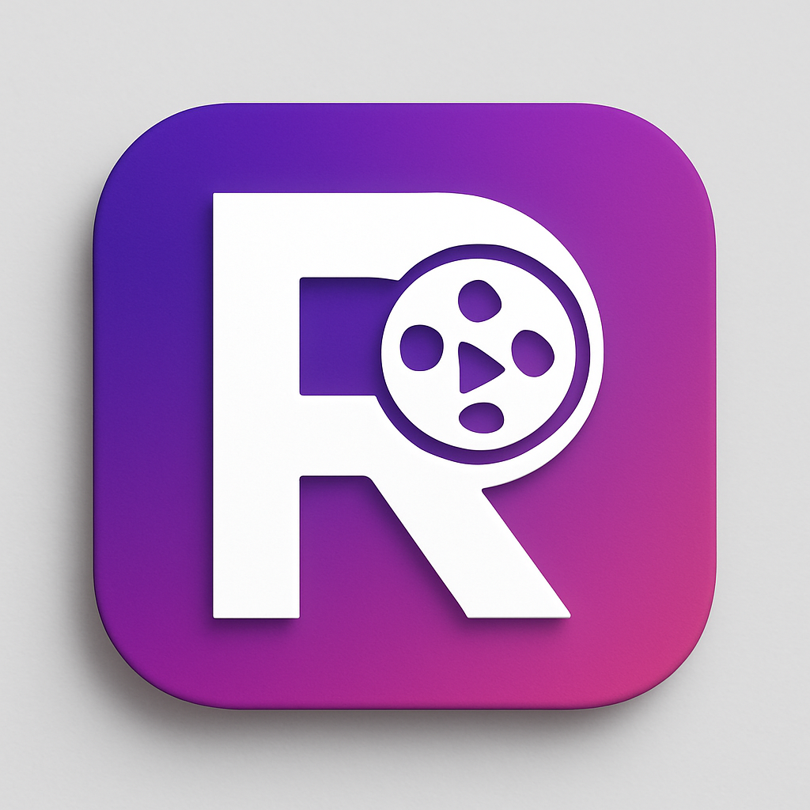

# Reelify

<p align="center">
  
</p>

Reelify is a modern short-form video viewing application built with Flutter that implements a TikTok/Instagram Reels-style experience. The application showcases best practices in mobile development including clean architecture, efficient video loading and caching strategies, and reactive state management.

## 📱 Features

- **Vertical Swipe Navigation**: Smooth swipe gestures to navigate between videos
- **Smart Video Preloading**: Preloads adjacent videos for seamless viewing experience
- **Video Playback Controls**:
  - Play/pause on tap
  - Double-tap to like
  - Hold to speed up playback
- **Social Interactions**:
  - Like videos
  - View and post comments
  - Share content with others
- **Efficient Memory Management**: Disposes unused video controllers to optimize memory usage
- **Pull-to-refresh**: Update feed with fresh content
- **Infinite Scrolling**: Automatic pagination when reaching the end of available content

## 🏗️ Architecture

Reelify follows Clean Architecture principles to maintain separation of concerns and testable code:

### Data Layer

- **Data Sources**: Remote (API) and Local (Cache) data sources
- **Models**: Data Transfer Objects (DTOs) for serialization/deserialization
- **Repositories**: Implementation of domain repositories

### Domain Layer

- **Entities**: Core business models
- **Repositories**: Abstract definitions of data operations
- **Use Cases**: Business logic components

### Presentation Layer

- **BLoC**: State management using the BLoC pattern
- **Pages**: UI screens
- **Widgets**: Reusable UI components

### Service Layer

- **API Service**: Handles network requests to the backend
- **Cache Service**: Manages local data persistence

## 🧩 Key Components

### Byte Entity

Core business model representing a short-form video with associated metadata:

```dart
class Byte {
  final String id;
  final String title;
  final String url;
  final String cdnUrl;
  final String thumbCdnUrl;
  final User user;
  final Category category;
  // Additional properties...
}
```

### Video Loading Strategy

Implements an optimized strategy for loading videos:

1. **Just-in-time initialization**: Videos are initialized only when needed
2. **Smart preloading**: Next 2 videos and previous video are preloaded
3. **Memory management**: Far-off-screen videos are disposed

### State Management

Uses the BLoC pattern to manage application state:

- **Events**: User actions like fetching initial or next page of videos
- **States**: Loading, loaded, error states with appropriate data
- **BLoC**: Processes events and emits states

## 📋 Project Structure

```
lib/
├── data/               # Data layer components
│   ├── data_sources/   # Remote and local data sources
│   ├── models/         # Data models and DTOs
│   └── repositories/   # Repository implementations
├── di/                 # Dependency injection
│   └── injection_container.dart
├── domain/             # Domain layer components
│   ├── entities/       # Core business models
│   ├── repositories/   # Repository interfaces
│   └── use_cases/      # Business logic components
├── presentation/       # Presentation layer components
│   ├── bloc/           # BLoC state management
│   ├── screens/        # UI screens
│   └── widgets/        # Reusable UI components
├── services/           # External services
│   ├── api_service/    # Network requests
│   └── cache_service/  # Local data persistence
├── utils/              # Utility functions and helpers
└── main.dart           # Application entry point
```

## 🚀 Getting Started

### Prerequisites

- Flutter 3.19.0 or higher
- Dart 3.6.0 or higher

### Installation

1. Clone the repository:

   ```
   git clone https://github.com/Shehzaan-Mansuri/reelify.git
   ```

2. Navigate to the project directory:

   ```
   cd reelify
   ```

3. Install dependencies:

   ```
   flutter pub get
   ```

4. Run the app:
   ```
   flutter run
   ```

## 🧠 Advanced Topics

### Video Caching Strategy

Reelify implements a dual-layer caching strategy:

1. **In-memory caching**:

   - Maintains active VideoPlayerControllers in a map
   - Intelligently disposes controllers for videos far from view

2. **Persistent caching**:

   - Uses flutter_cache_manager for file caching
   - Implements SharedPreferences for metadata storage
   - Example usage:

     ```dart
     // Cache video files
     await _cacheManager.downloadFile(videoUrl);

     // Cache video metadata
     await cacheService.cacheBytes(bytesList);
     ```

### Pagination Implementation

The app implements infinite scrolling with the following strategy:

1. Detects when user is near the end of the list (within last 1-2 items)
2. Checks if more content is available and not already loading
3. Dispatches fetch event to the BLoC
4. Updates UI when new content is available

### Memory Optimization

Key techniques used for memory management:

1. **Controller lifecycle management**:

   ```dart
   // Only keep controllers for videos near the current view
   final keysToRemove = _videoControllers.keys
       .where((key) => (key - _currentPageIndex).abs() > 2)
       .toList();

   // Dispose far away controllers
   for (final key in keysToRemove) {
     _videoControllers[key]?.dispose();
     _videoControllers.remove(key);
   }
   ```

2. **Visibility-based playback control**:
   ```dart
   // Only play videos when they're mostly visible
   if (visibilityInfo.visibleFraction > 0.7) {
     if (!_videoControllers[index]!.value.isPlaying) {
       _videoControllers[index]!.play();
     }
   } else {
     if (_videoControllers[index]!.value.isPlaying) {
       _videoControllers[index]!.pause();
     }
   }
   ```

## 📦 Dependencies

The project uses the following key packages:

- **flutter_bloc**: State management
- **get_it**: Dependency injection
- **video_player**: Video playback
- **flutter_cache_manager**: File caching
- **shared_preferences**: Persistent storage
- **visibility_detector**: UI visibility detection
- **share_plus**: Content sharing

## 📄 License

This project is licensed under the MIT License - see the LICENSE file for details.

## 👥 Contributing

1. Fork the Project
2. Create your Feature Branch (`git checkout -b feature/AmazingFeature`)
3. Commit your Changes (`git commit -m 'Add some AmazingFeature'`)
4. Push to the Branch (`git push origin feature/AmazingFeature`)
5. Open a Pull Request

## 📞 Contact

Developer: [Shehzaan Mansuri](mailto:shehzaanmansuri1@gmail.com)

Project Link: [Reelify](https://github.com/Shehzaan-Mansuri/reelify)
